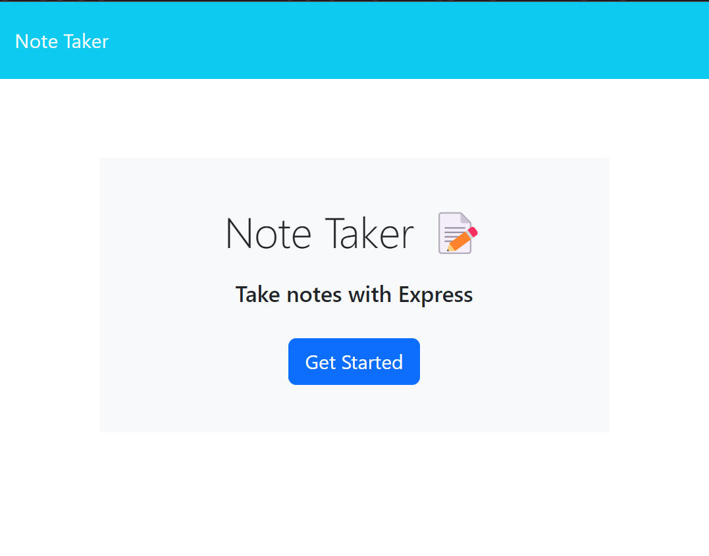
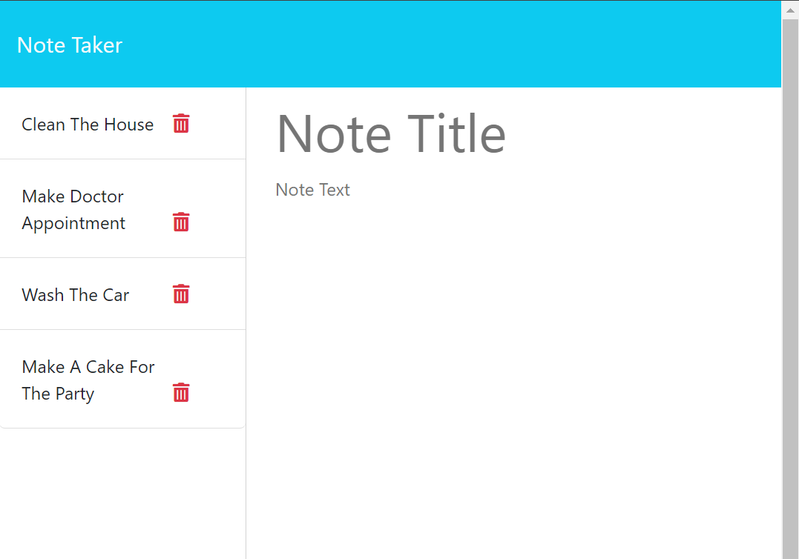

# Note Taker


## Description

The Note Taker App is a simple and intuitive application that allows users to create, save, and delete notes. This app is designed to help users keep track of their thoughts and tasks with ease. Built with Express.js for the backend and JavaScript for the frontend, the Note Taker App offers a seamless and user-friendly experience.

## Table of Contents

- [Installation](#installation)
- [Usage](#usage)
- [API Routes](#api-routes)
- [Screenshots](#screenshots)
- [License](#license)
- [Contributing](#contributing)
- [Acknowledgements](#acknowledgements)
- [Questions](#questions)

## Installation

To run the Note Taker App locally, follow these steps:

1. Clone the repository:
    ```sh
    git clone https://github.com/contra19/note-taker.git
    ```
2. Navigate to the project directory:
    ```sh
    cd note-taker
    ```
3. Install the dependencies:
    ```sh
    npm install
    ```
4. Start the server:
    ```sh
    npm start
    ```
    The app will be running at `http://localhost:3001`.

## Usage

1. Open your browser and navigate to `http://localhost:3001`.
2. Click on the "Get Started" button on the homepage.
3. Enter a title and text for your note.
4. Click the "Save" button to save the note.
5. View saved notes by clicking on them in the left sidebar.
6. Delete a note by clicking the red trash can icon next to it.

## API Routes

The Note Taker App provides the following API routes:

- `GET /api/notes`: Retrieves all saved notes.
- `POST /api/notes`: Saves a new note. The note object should include a `title` and `text`.
- `DELETE /api/notes/:id`: Deletes a note with the specified `id`.

## Screenshots

### Homepage


### Notes Page


### Demo Video
[Watch the Demo Video](https://drive.google.com/file/d/1zARLnYnl7rJhHGUMmlD4EyIyQuahbugg/view?usp=drive_link)

### Link to Render Deployment
[Note Taker Render Deployment](https://note-taker-3eo2.onrender.com)

## License


This project is licensed under the MIT License. See the [LICENSE](LICENSE) file for details.

## Contributing

Contributions are welcome! Please follow these steps to contribute:

1. Fork the repository.
2. Create a new branch (`git checkout -b feature/YourFeature`).
3. Commit your changes (`git commit -m 'Add some feature'`).
4. Push to the branch (`git push origin feature/YourFeature`).
5. Open a Pull Request.

## Acknowledgements

Special thanks to [Nick Zamboni](https://github.com/ndzamboni) and [Tristin Rohr](https://github.com/TristinRohr)for their valuable input and code examples.
This helped give me direction and inspiration on how to organize and complete my code. 

## Questions

If you have any questions about the project, please feel free to contact me:

- GitHub: [contra19](https://github.com/contra19)
- Email: [contra19](mailto:grimwolf@grimwolfstudios.com)
